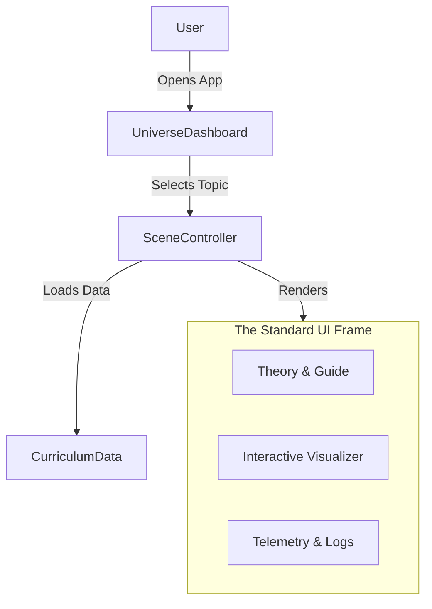

# Network Universe: Architecture Deep Dive (HLD & LLD)

## 🌟 1. Project Overview (Vision)
**Goal**: Teach Computer Networks offering a "Textbook-level depth" with "Video Game-level visuals".
**Core Metaphor (Anti-Gravity)**:
- Gravity does not pull data down.
- Data moves via **Attraction** (Requests), **Propulsion** (Routing), and **Filtering** (Security).
- Visual Style: Dark Space Theme (Neon, Glowing, Sci-Fi).

---

## 🏗️ 2. High-Level Design (HLD)

### System Architecture
The application follows a **Scene-Based Architecture**.

### Key Modules Implemented (So Far)
1.  **Intro Scene**: The concept of "Connection" (Chaos vs Order).
2.  **Devices Scene**: Hardware behaviors (Hub vs Switch vs Router).
3.  **OSI Model**: The 7-Layer Deep Dive (State Machine driven).
4.  **TCP Handshake**: The 3-Way Connection Logic (SYN, SYN-ACK, ACK).
5.  **Routing**: Pathfinding Algorithms (Dijkstra).
6.  **DNS**: Recursive Resolution (The Star Map).
7.  **Security**: Firewall Packet Filtering.

---

## ⚙️ 3. Low-Level Design (LLD)

### A. The Core UI Engine (`src/ui/`)
To resolve CSS issues and ensure consistency, we built a rigid Grid System:
*   **`LessonLayout.jsx`**: A 3-column React component.
    *   **Col 1 (25%)**: `theoryContent` - Scrollable text/bullets.
    *   **Col 2 (50%)**: `visualContent` - The Framer Motion stage.
    *   **Col 3 (25%)**: `telemetryContent` - Real-time logs and controls.

### B. The Simulation Engine (`src/engine/NetworkSimulator.js`)
Used specifically for the OSI Scene. It is a **Finite State Machine (FSM)**.
*   **States**: `IDLE` -> `CLIENT_DOWN` (Encapsulation) -> `NETWORK_TRAVEL` -> `SERVER_UP` (Decapsulation) -> `SERVER_PROCESS` -> ...
*   **Logic**: It controls the "Pulse" of the animation, ensuring layers don't skip and packets move in sync.

### C. Component Drill-Down
| Component | Responsibility | Tech Details |
| :--- | :--- | :--- |
| **`UniverseDashboard`** | Main Menu | Grid of Cards. Handles Navigation State. |
| **`OsiPacket`** | The "Ball" | Renders concentric rings based on `encapsulationLevel`. |
| **`TelemetryPanel`** | Data Inspector | Shows Headers (IP, TCP, MAC) changing in real-time. |
| **`IntroScene`** | Module 1 | Uses `framer-motion` spring physics to organize nodes. |
| **`DevicesScene`** | Module 2 | Logic for `broadcast` vs `unicast`. Activity Log implemented. |

## 🚀 4. Current Progress & Next Steps

### Status:
*   ✅ **Framework**: Solid.
*   ✅ **Content**: 7 Major Topics active.
*   ✅ **Visuals**: High quality (Space Theme).
*   ✅ **UX**: Improved with `LessonLayout`.

### Immediate To-Dos:
1.  **Refactor Remaining Scenes**: Apply `LessonLayout` to TCP, Routing, DNS, and Security scenes to match the quality of Intro/OSI/Devices.
2.  **Mobile Responsiveness**: Currently optimized for Desktop.
